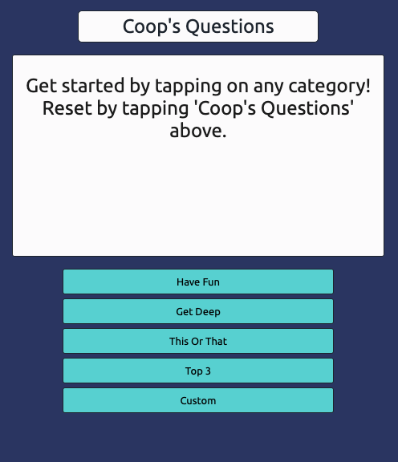
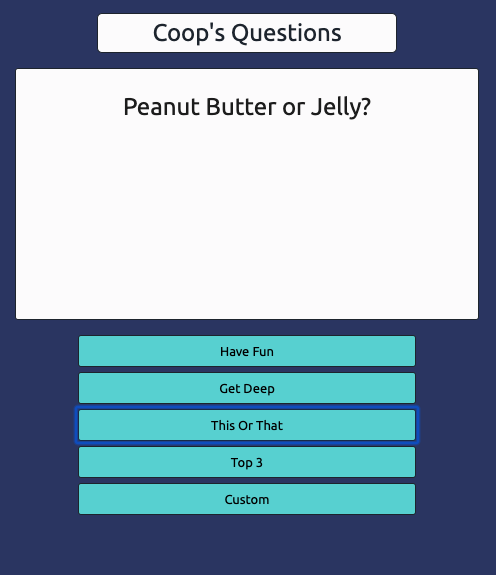
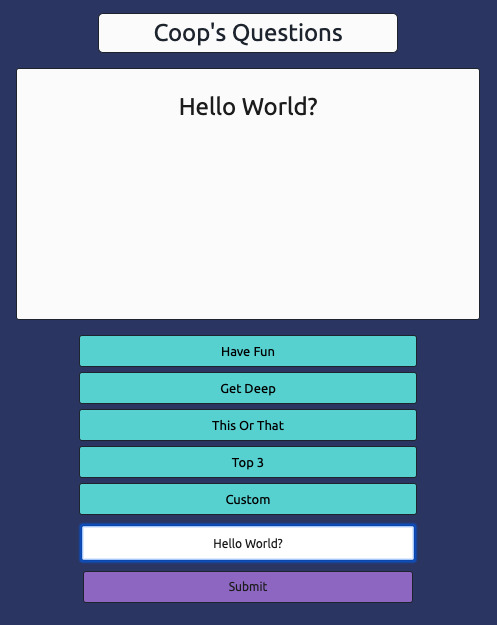
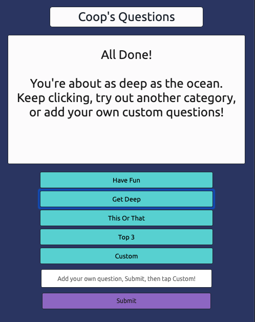

<h1>Coop's Questions - Good questions skim the surface. Great questions drive meaningful connection.</h1> 

## Description:
Coop's Questions is a collection of questions split into several various categories. This project is intended for use by new friends, old friends, family, anyone you hope to get closer to or have some fun with. So often we are paralyzed by social interactions and overthinking that we don't even begin to converse with each other, always resorting to small talk; I've been doing well, the weather is good, so was my weekend. While you may not want to get into personal details with co-workers, this project offers a variety of (growing) categories and questions to spark up conversations with each other; spend some time debating whether savory or sweet is better, or maybe come to the realization that you both love the same movies. For those who seek to enrich or rebuild existing relationships with friends or family, there are even more questions for you. Sometimes all it takes is one question to start meaningful conversations and open the door to connection.

## Examples:
;
;
;
;

## Current Features
On load, you will be prompted to begin tapping on categories, followed by reset instructions. With each page load each unique category is randomly shuffled and filled with questions, and each tap on a specific category will begin to cycle through their respective questions. Once all the questions in that category have been viewed, the text will be updated with instructions to continue; tap the same category to cycle through questions again, try a new category, or add your own custom questions. On tapping 'Custom', an input prompt and submit button will appear, instructing users to add their own question, hit submit (or return/enter), and begin tapping custom, which will randomize and display their own questions. Users may then continue to cycle through different categories and questions. Sizing is responsive and optimized for desktop and mobile, both vertical and horizontal, so users can comfortably access the project at home or on the go.

## Features in Progress
The next immediate feature in progress will be setting up a Google Sheets API, to simplify and streamline the process of adding and editing questions. Moving forward, there are plans to implement accounts, where users can create a profile and store their own custom questions. Additionally, users can upvote questions to provide positive feedback to aid in generating new questions, while the downvote will remove the question from their account (example shown below). Next, users can 'connect' with other users, combining their pool of custom questions and eliminating any questions each may have removed previously.  

;

## Technologies Used
The technologies used for this project include HTML, CSS, and JavaScript.

## Installation Instructions
Visit https://coopertuch.github.io/GA-Project-1/ to play the game!

## Contribution Guidelines
Additional questions are always welcome, along with any other ideas for improvement. 
View existing code here - https://github.com/coopertuch/GA-Project-1
Submit an issue here - https://github.com/coopertuch/GA-Project-1/issues